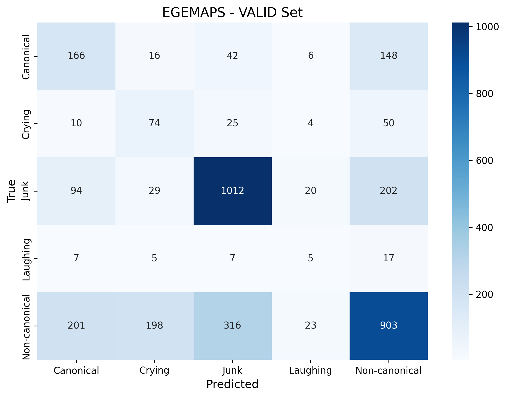
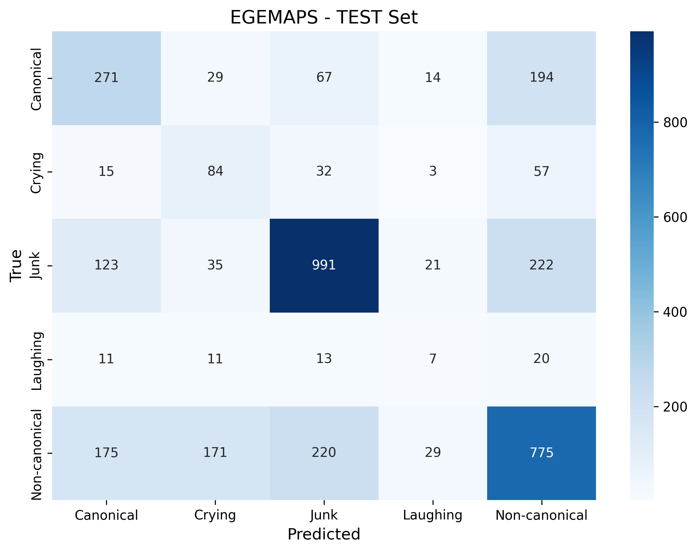
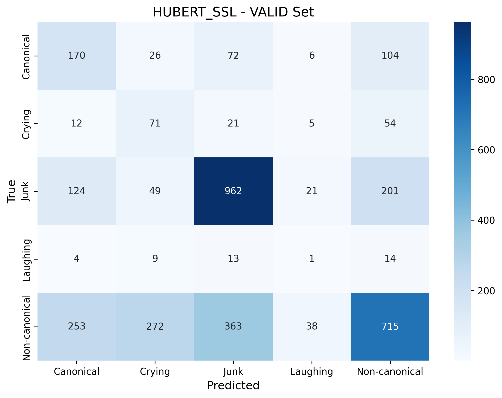
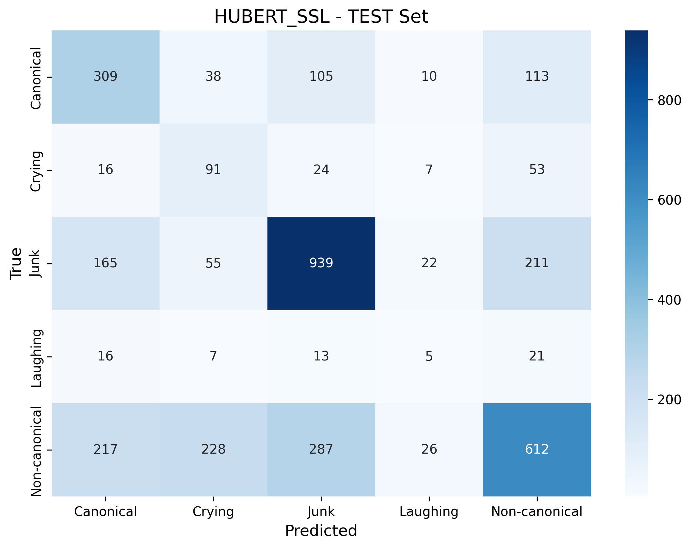
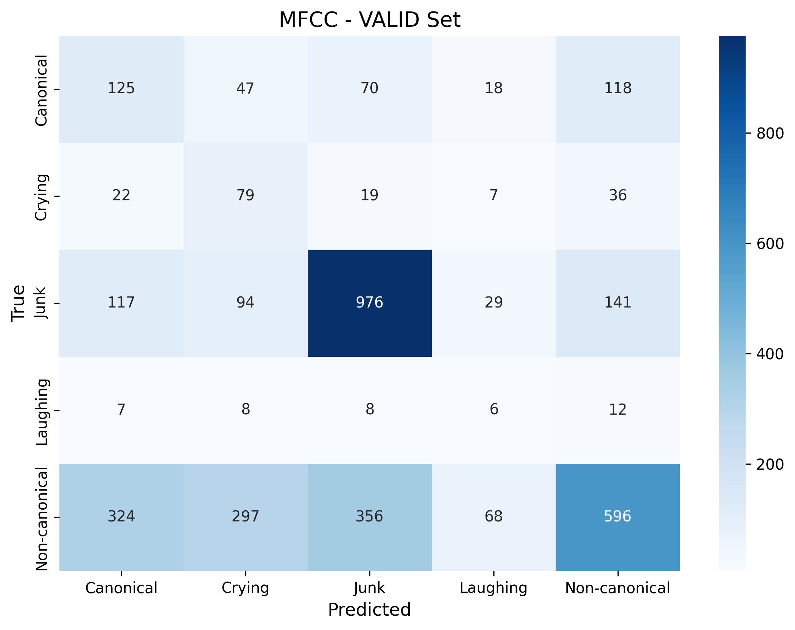
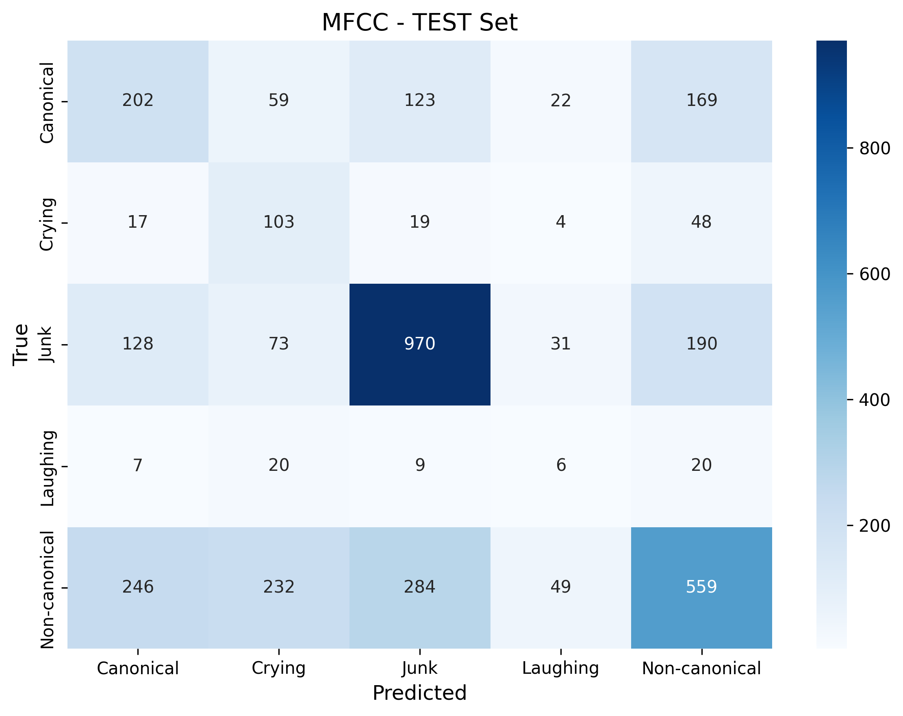
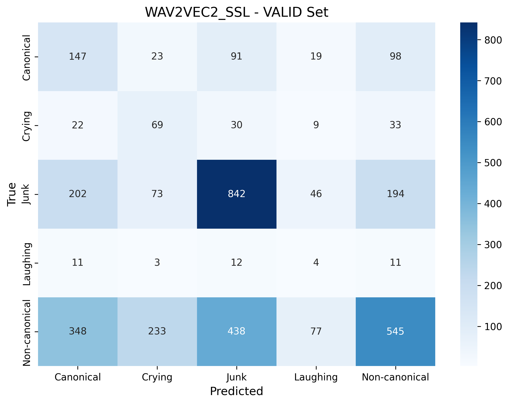
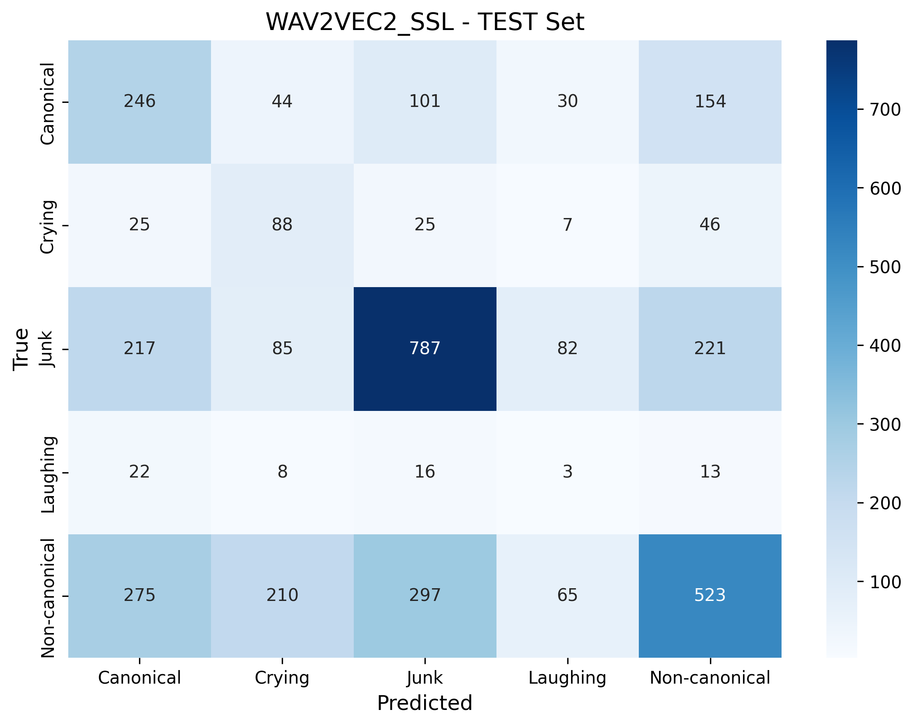

# VocalBaby — Infant Vocalization Classification: From Feature Comparison to Production

[](https://www.python.org/)
[](https://docs.astral.sh/uv/)
[](https://xgboost.readthedocs.io/)
[](https://pytorch.org/)
[](https://developer.nvidia.com/cuda-toolkit)
[](https://fastapi.tiangolo.com/)
[](https://www.docker.com/)
[](https://prometheus.io/)
[](https://grafana.com/)
[](https://www.terraform.io/)
[](https://dvc.org/)
[](https://github.com/features/actions)
[](https://aws.amazon.com/)
[](https://www.evidentlyai.com/)
[](https://audeering.github.io/opensmile-python/)
[](https://scikit-learn.org/)
[](https://optuna.org/)
[](https://docs.astral.sh/ruff/)
[](LICENSE)

**An end-to-end infant vocalization classification system — from acoustic feature comparison research to a production-ready MLOps pipeline.**

---

## Project Purpose

This project was developed in **two phases**:

### Phase 1: Feature Comparison Research

We systematically compared **XGBoost classifier performance** across 4 acoustic feature representations to identify the optimal feature set for infant vocalization classification:

- **eGeMAPS** (88-dim openSMILE features)
- **MFCC** (40-dim librosa features)
- **HuBERT SSL** (768-dim embeddings from [arunps/hubert-home-hindibabynet-ssl](https://huggingface.co/arunps/hubert-home-hindibabynet-ssl))
- **Wav2Vec2 SSL** (768-dim embeddings from [arunps/wav2vec2-home-hindibabynet-ssl](https://huggingface.co/arunps/wav2vec2-home-hindibabynet-ssl))

Each feature set was independently tuned with **Optuna (40 trials, multi-objective: UAR + F1)**, evaluated on both validation and test splits, and compared via confusion matrices, classification reports, and aggregated metrics.

> **Result: eGeMAPS (88-dim handcrafted features) consistently outperformed the 768-dim SSL embeddings** across all metrics (UAR=0.460, Weighted F1=0.600 on test).

### Phase 2: Production-Ready MLOps System

Based on the research findings, we built a **complete production pipeline** using the best-performing eGeMAPS + XGBoost combination, equipped with:

- **FastAPI** prediction server with `/predict` and `/predict_zip` endpoints
- **DVC** pipeline for reproducible 7-stage training
- **Docker** containerization for deployment
- **Prometheus + Grafana** monitoring stack
- **Evidently** data drift detection
- **GitHub Actions** CI/CD (lint → build → push to ECR → deploy to EC2)
- **Terraform** infrastructure-as-code for AWS (VPC, ECR, EC2, S3, IAM)

---

## Overview

**VocalBaby** is an end-to-end multi-class audio classification system designed for child language acquisition research. It classifies short infant audio segments into **5 vocalization categories**:

| Class | Description | Train | Valid | Test | Total | % |
|-------|-------------|------:|------:|-----:|------:|---:|
| **Non-canonical** | Non-canonical infant vocalizations (e.g., squeals, growls, vowel-like sounds) | 1,437 | 1,641 | 1,370 | 4,448 | 41.3% |
| **Junk** | Background noise, silence, or non-speech artifacts | 1,430 | 1,357 | 1,392 | 4,179 | 38.8% |
| **Canonical** | Canonical babbling (consonant–vowel syllables like "ba", "da") | 444 | 378 | 575 | 1,397 | 13.0% |
| **Crying** | Infant cry episodes | 243 | 163 | 191 | 597 | 5.5% |
| **Laughing** | Infant laughter | 46 | 41 | 62 | 149 | 1.4% |
| | **Total** | **3,600** | **3,580** | **3,590** | **10,770** | |

The system focuses on infant and adult vocalizations in naturalistic interaction recordings.

---

## Quick Start

### Prerequisites

- Python 3.10+
- [uv](https://docs.astral.sh/uv/) package manager (recommended) or pip
- DVC (for pipeline orchestration)
- Git (for version control)

### Installation

```bash
# Clone repository
git clone https://github.com/arunps12/VocalBaby.git
cd VocalBaby

# Create virtual environment and install dependencies (using uv)
uv venv
source .venv/bin/activate  # On Windows: .venv\Scripts\activate
uv pip install -e .

# Or using pip
python -m venv .venv
source .venv/bin/activate
pip install -e .
```

### Running the Pipeline

#### Option 1: DVC Pipeline (Recommended)

Run the entire 7-stage pipeline with DVC:

```bash
# Run complete pipeline (all 7 stages)
dvc repro

# Run specific stage and its dependencies
dvc repro ingest      # Stage 01: Data ingestion only
dvc repro validate    # Stages 01-02: Through validation
dvc repro evaluate    # Stages 01-06: Through evaluation
dvc repro aggregate   # Full pipeline: All 7 stages
```

#### Option 2: Manual Stage Execution

Run individual stages via bash scripts:

```bash
# Stage 01: Data Ingestion
bash scripts/01_ingest.sh

# Stage 02: Data Validation
bash scripts/02_validate.sh

# Stage 03: Feature Extraction (all feature sets from params.yaml)
bash scripts/03_transform.sh

# Or extract specific feature set(s)
bash scripts/03_transform.sh --feature-sets mfcc

# Stage 04: Hyperparameter Tuning
bash scripts/04_tune.sh

# Or tune specific feature set(s) with custom trial count
bash scripts/04_tune.sh --feature-sets egemaps mfcc --n-trials 20

# Stage 05: Model Training
bash scripts/05_train.sh

# Stage 06: Model Evaluation
bash scripts/06_evaluate.sh

# Stage 07: Results Aggregation
bash scripts/07_aggregate.sh
```

#### Option 3: Python Module Execution

Run stages directly as Python modules:

```bash
python -m vocalbaby.pipeline.stage_01_ingest
python -m vocalbaby.pipeline.stage_02_validate
python -m vocalbaby.pipeline.stage_03_transform --feature-sets mfcc --force
python -m vocalbaby.pipeline.stage_04_tune --n-trials 10
python -m vocalbaby.pipeline.stage_05_train
python -m vocalbaby.pipeline.stage_06_evaluate
python -m vocalbaby.pipeline.stage_07_aggregate
```

#### Running the Prediction Server

```bash
# Via console entry point
uv run vocalbaby-serve

# Or via uvicorn directly
uv run uvicorn vocalbaby.api.app:app --host 0.0.0.0 --port 8000
```

The server runs at `http://localhost:8000`:
- **Swagger docs:** http://localhost:8000/docs
- **Prometheus metrics:** http://localhost:8000/metrics
- **Health check:** http://localhost:8000/health

---

## Pipeline Architecture

### 7-Stage ML Pipeline

```
┌─────────────────────────────────────────────────────────────────┐
│  STAGE 01: DATA INGESTION                                       │
│  • Loads raw audio + metadata                                   │
│  • Creates child-disjoint train/valid/test splits               │
│  Output: data_ingestion/                                        │
└───────────────────────┬─────────────────────────────────────────┘
                        ▼
┌─────────────────────────────────────────────────────────────────┐
│  STAGE 02: DATA VALIDATION                                      │
│  • Schema validation                                            │
│  • Data quality checks                                          │
│  • Drift detection                                              │
│  Output: data_validation/                                       │
└───────────────────────┬─────────────────────────────────────────┘
                        ▼
┌─────────────────────────────────────────────────────────────────┐
│  STAGE 03: FEATURE EXTRACTION                                   │
│  • eGeMAPS (88-dim openSMILE)                                   │
│  • MFCC (20/40-dim librosa)                                     │
│  • HuBERT SSL (768-dim transformers)                            │
│  • Wav2Vec2 SSL (768-dim transformers)                          │
│  Output: features/<feature_set>/<split>/                        │
└───────────────────────┬─────────────────────────────────────────┘
                        ▼
┌─────────────────────────────────────────────────────────────────┐
│  STAGE 04: HYPERPARAMETER TUNING                                │
│  • Optuna optimization (40 trials)                              │
│  • Multi-objective: UAR + Macro F1                              │
│  • Independent tuning per feature set                           │
│  Output: tuning/<feature_set>/best_params.json                  │
└───────────────────────┬─────────────────────────────────────────┘
                        ▼
┌─────────────────────────────────────────────────────────────────┐
│  STAGE 05: MODEL TRAINING                                       │
│  • XGBoost training with best params                            │
│  • SMOTE oversampling (k=5, random_state=42)                    │
│  • Label encoding + median imputation                           │
│  Output: models/<feature_set>/xgb_model.pkl                     │
└───────────────────────┬─────────────────────────────────────────┘
                        ▼
┌─────────────────────────────────────────────────────────────────┐
│  STAGE 06: MODEL EVALUATION                                     │
│  • Evaluation on valid + test splits                            │
│  • Confusion matrices (PNG + CSV)                               │
│  • Classification reports                                       │
│  • Metrics: Accuracy, UAR, F1, Precision, Recall                │
│  Output: eval/<feature_set>/                                    │
└───────────────────────┬─────────────────────────────────────────┘
                        ▼
┌─────────────────────────────────────────────────────────────────┐
│  STAGE 07: RESULTS AGGREGATION                                  │
│  • Comparison table across all feature sets                     │
│  • Metrics for both valid and test splits                       │
│  Output: results/results_summary.csv                            │
└─────────────────────────────────────────────────────────────────┘
```

### Feature Sets

| Feature Set | Dimension | Extractor | Description |
|-------------|-----------|-----------|-------------|
| **egemaps** | 88 | openSMILE | Extended Geneva Minimalistic Acoustic Parameter Set |
| **mfcc** | 40 | librosa | Mel-Frequency Cepstral Coefficients (mean+std pooling) |
| **hubert_ssl** | 768 | HuggingFace Transformers | HuBERT SSL embeddings from [arunps/hubert-home-hindibabynet-ssl](https://huggingface.co/arunps/hubert-home-hindibabynet-ssl) |
| **wav2vec2_ssl** | 768 | HuggingFace Transformers | Wav2Vec2 SSL embeddings from [arunps/wav2vec2-home-hindibabynet-ssl](https://huggingface.co/arunps/wav2vec2-home-hindibabynet-ssl) |

#### Self-Supervised Learning (SSL) Models

The **HuBERT** and **Wav2Vec2** models used in this pipeline are **custom fine-tuned versions** trained on infant vocalization data:

- **[arunps/hubert-home-hindibabynet-ssl](https://huggingface.co/arunps/hubert-home-hindibabynet-ssl)** - HuBERT model fine-tuned on home environment infant speech recordings from the HindiBabyNet corpus. This model is specifically adapted for infant vocalization patterns and home recording conditions.

- **[arunps/wav2vec2-home-hindibabynet-ssl](https://huggingface.co/arunps/wav2vec2-home-hindibabynet-ssl)** - Wav2Vec2 model fine-tuned on the same infant speech data. It provides complementary self-supervised representations optimized for infant cry and babbling classification.

**Why SSL models?** Self-supervised learning models pre-trained on large speech corpora and fine-tuned on domain-specific data (infant vocalizations) often capture richer acoustic-phonetic representations than traditional hand-crafted features. These 768-dimensional embeddings encode temporal dynamics, prosodic patterns, and spectral characteristics that are particularly useful for distinguishing between canonical babbling, non-canonical vocalizations, crying, and laughing.

**Model Architecture:**
- Base architecture: HuBERT-base / Wav2Vec2-base (12 transformer layers)
- Hidden size: 768 dimensions
- Fine-tuning: Infant vocalization data from naturalistic home recordings
- Inference: Mean-pooled temporal embeddings (768-dim fixed-length vectors)

---

## Project Structure

```
.
├── params.yaml                    # Central configuration file
├── dvc.yaml                       # DVC pipeline definition
├── pyproject.toml                 # Package metadata & dependencies
├── README.md                      # This file
│
├── data/                          # Raw data (not versioned)
│   ├── audio/raw/                 # Raw .wav files
│   └── metadata/                  # Metadata CSV files
│
├── data_schema/                   # Data validation schemas
│   └── schema.yaml
│
├── scripts/                       # Bash runner scripts
│   ├── 01_ingest.sh              # Stage 01: Data ingestion
│   ├── 02_validate.sh            # Stage 02: Data validation
│   ├── 03_transform.sh           # Stage 03: Feature extraction
│   ├── 04_tune.sh                # Stage 04: Hyperparameter tuning
│   ├── 05_train.sh               # Stage 05: Model training
│   ├── 06_evaluate.sh            # Stage 06: Model evaluation
│   └── 07_aggregate.sh           # Stage 07: Results aggregation
│
├── src/vocalbaby/                 # Main package (src-layout)
│   ├── config/                    # Configuration management
│   │   └── schemas.py
│   ├── data/                      # Data ingestion & validation
│   │   ├── ingest.py
│   │   └── validate.py
│   ├── features/                  # Feature extractors
│   │   ├── base.py
│   │   ├── egemaps.py
│   │   ├── mfcc.py
│   │   ├── hubert.py
│   │   └── wav2vec2.py
│   ├── models/                    # Hyperparameter tuning & training
│   ├── eval/                      # Evaluation & metrics
│   ├── pipeline/                  # 7 pipeline stage modules
│   │   ├── stage_01_ingest.py
│   │   ├── stage_02_validate.py
│   │   ├── stage_03_transform.py
│   │   ├── stage_04_tune.py
│   │   ├── stage_05_train.py
│   │   ├── stage_06_evaluate.py
│   │   └── stage_07_aggregate.py
│   ├── components/                # Legacy components (kept for compatibility)
│   ├── utils/                     # Utility functions
│   ├── logging/                   # Logging configuration
│   ├── exception/                 # Exception handling
│   └── cli.py                     # Command-line interface
│
├── notebooks/                     # Exploratory notebooks (not part of pipeline)
│   ├── 01_EDA.ipynb
│   ├── 02__feature_and_model_selection_experiments.ipynb
│   ├── ...
│   └── 06__xgboost_egemaps_smote_optuna_experiment.ipynb
│
└── tests/                         # Unit tests
```

---

## Configuration

All pipeline parameters are centralized in [`params.yaml`](params.yaml). Key sections:

### Data Configuration
```yaml
data:
  raw_audio_dir: data/audio/raw
  raw_metadata_file: data/metadata/private_metadata.csv
  seed: 42
```

### Feature Sets
```yaml
features:
  sets:
    - egemaps
    - mfcc
    - hubert_ssl
    - wav2vec2_ssl
  
  mfcc:
    n_mfcc: 20
    sample_rate: 16000
    pool: mean_std  # 40-dim output (mean+std)
```

### Hyperparameter Tuning
```yaml
tuning:
  framework: optuna
  n_trials: 40
  objectives:
    - uar        # Unweighted Average Recall
    - macro_f1   # Macro F1-score
  
  xgb_search_space:
    max_depth: [3, 12]
    learning_rate: [0.01, 0.3]
    n_estimators: [100, 1500]
    subsample: [0.5, 1.0]
    colsample_bytree: [0.5, 1.0]
    gamma: [0.0, 5.0]
    reg_alpha: [0.0, 5.0]
    reg_lambda: [0.0, 5.0]
```

### Evaluation
```yaml
evaluation:
  metrics:
    - accuracy
    - balanced_accuracy  # UAR
    - macro_f1
    - weighted_f1
  
  confusion_matrix:
    normalize: false
    save_csv: true
    save_png: true
```

### GPU Acceleration
```yaml
# XGBoost trains on GPU (set in code)
# device="cuda", tree_method="hist"

# SSL feature extraction on GPU
features:
  hubert_ssl:
    device: cuda
  wav2vec2_ssl:
    device: cuda
```

Modify `params.yaml` and re-run `dvc repro` to update the pipeline.

---

## Feature Comparison Results

### Phase 1 Evaluation (Feb 17, 2026)

#### Overall Comparison (Sorted by UAR)

| Rank | Feature Set | Split | UAR | Weighted F1 | Precision | Accuracy |
|------|------------|-------|-----|-------------|-----------|----------|
| 1 | **eGeMAPS** | valid | **0.462** | **0.614** | 0.635 | 60.3% |
| 2 | **eGeMAPS** | test | **0.460** | **0.600** | 0.612 | 59.3% |
| 3 | HuBERT SSL | test | 0.443 | 0.554 | 0.579 | 54.5% |
| 4 | MFCC | test | 0.418 | 0.522 | 0.550 | 51.3% |
| 5 | HuBERT SSL | valid | 0.411 | 0.551 | 0.596 | 53.6% |
| 6 | MFCC | valid | 0.409 | 0.519 | 0.591 | 49.8% |
| 7 | Wav2Vec2 SSL | test | 0.377 | 0.478 | 0.519 | 45.9% |
| 8 | Wav2Vec2 SSL | valid | 0.372 | 0.468 | 0.539 | 44.9% |

#### Per-Class F1-Scores (Test Split)

| Class | eGeMAPS | MFCC | HuBERT SSL | Wav2Vec2 SSL | Support |
|-------|---------|------|------------|--------------|--------:|
| Canonical | **0.463** | 0.344 | 0.476 | 0.362 | 575 |
| Crying | **0.322** | 0.304 | 0.298 | 0.281 | 191 |
| Junk | **0.730** | 0.694 | 0.680 | 0.601 | 1,392 |
| Laughing | **0.103** | 0.069 | 0.076 | 0.024 | 62 |
| Non-canonical | **0.588** | 0.475 | 0.514 | 0.450 | 1,370 |

> **Key finding:** eGeMAPS (88-dim handcrafted features) outperforms the 768-dim SSL embeddings when used with XGBoost. This finding drove the decision to use **eGeMAPS as the production feature set**. All models struggle with the **Laughing** class (F1 < 0.11) due to extreme scarcity (only 46 training samples).

#### Best Hyperparameters (Optuna, 40 Trials)

| Parameter | eGeMAPS | MFCC | HuBERT SSL | Wav2Vec2 SSL |
|-----------|---------|------|------------|-------------:|
| `max_depth` | 4 | 7 | 3 | 3 |
| `learning_rate` | 0.120 | 0.013 | 0.012 | 0.030 |
| `n_estimators` | 357 | 623 | 1,027 | 214 |
| `subsample` | 0.720 | 0.714 | 0.640 | 0.701 |
| `gamma` | 2.358 | 2.930 | 1.000 | 0.746 |

### Confusion Matrices

#### eGeMAPS

| Validation | Test |
|:----------:|:----:|
|  |  |

#### HuBERT SSL

| Validation | Test |
|:----------:|:----:|
|  |  |

#### MFCC

| Validation | Test |
|:----------:|:----:|
|  |  |

#### Wav2Vec2 SSL

| Validation | Test |
|:----------:|:----:|
|  |  |

---

## Methodology

### Data Preprocessing

1. **Child-Disjoint Splits** - Train/valid/test splits ensure no child appears in multiple splits
2. **Label Encoding** - Categorical labels converted to integers (0-4)
3. **Missing Value Imputation** - Median imputation for any missing features
4. **Class Imbalance Handling** - SMOTE oversampling (k=5) applied to training set only

### Hyperparameter Optimization

- **Framework**: Optuna with TPESampler
- **Trials**: 40 per feature set
- **Objectives**: Unweighted Average Recall (UAR) + Macro F1-score
- **Search Space**: Independent for each feature set (see `params.yaml`)
- **Validation**: Best params selected based on validation set performance

### Model Training

- **Algorithm**: XGBoost (multi:softprob objective)
- **GPU Acceleration**: `device="cuda"`, `tree_method="hist"` (NVIDIA RTX 2080 Ti)
- **Random State**: 42 (for reproducibility)
- **Preprocessing**: Applied consistently (imputation → SMOTE → label encoding)

### Evaluation

- **Splits**: Both validation and test (ensures no overfitting)
- **Metrics**: Accuracy, Balanced Accuracy (UAR), Macro/Weighted F1, Precision, Recall
- **Confusion Matrices**: Raw counts (not normalized) saved as PNG + CSV

---

## System Architecture & Workflow (Phase 2: Production)

```
┌──────────────────────────────────────────────────────────────────────────────┐
│                         DATA LAYER                                          │
│   Raw .wav Audio  +  Metadata CSV (child_ID, age, gender, Answer, corpus)   │
└────────────────────────────────┬─────────────────────────────────────────────┘
                                 ▼
┌──────────────────────────────────────────────────────────────────────────────┐
│                     DVC PIPELINE (dvc repro)                                 │
│                                                                              │
│  1. Data Ingestion ──► 2. Validation ──► 3. Feature Extraction ──► 4. Train  │
│  (train/valid/test)    (schema+drift)    (openSMILE eGeMAPS)      (XGBoost)  │
└──────────┬──────────────────────────────────────────────────┬────────────────┘
           │                                                  │
           ▼                                                  ▼
┌─────────────────────────┐                    ┌──────────────────────────────┐
│   ML & FEATURE STACK    │                    │      MODEL ARTIFACTS         │
│                         │                    │                              │
│  • openSMILE (eGeMAPS)  │                    │  • xgb_egemaps_smote_optuna  │
│  • SMOTE oversampling   │                    │  • preprocessing.pkl         │
│  • XGBoost classifier   │                    │  • label_encoder.pkl         │
│  • Optuna HPO           │                    │                              │
│  • scikit-learn         │                    └──────────────┬───────────────┘
└─────────────────────────┘                                   │
                                                              ▼
┌──────────────────────────────────────────────────────────────────────────────┐
│                          SERVING LAYER                                       │
│                                                                              │
│   FastAPI Server (port 8000)                                                 │
│   ├── /predict        Classify .wav file(s)                                  │
│   ├── /predict_zip    Classify ZIP of .wav files                             │
│   └── /metrics        Prometheus metrics endpoint                            │
└──────────────────────────────────┬───────────────────────────────────────────┘
                                   │
                                   ▼
┌──────────────────────────────────────────────────────────────────────────────┐
│                        MONITORING STACK                                      │
│                                                                              │
│   Prometheus (scrape metrics) ──► Grafana (dashboards)                       │
│   Evidently (data drift detection)                                           │
└──────────────────────────────────────────────────────────────────────────────┘

┌──────────────────────────────────────────────────────────────────────────────┐
│                     CI/CD (GitHub Actions)                                    │
│                                                                              │
│   Lint & Test ──► Build & Push (Docker → ECR) ──► Deploy (EC2)               │
│   Nightly Drift (cron) ──► Evidently                                         │
└──────────────────────────────────────────────────────────────────────────────┘

┌──────────────────────────────────────────────────────────────────────────────┐
│                   AWS INFRASTRUCTURE (Terraform)                             │
│                                                                              │
│   VPC / Subnets  │  ECR (Registry)  │  EC2 (Compute)  │  S3  │  IAM         │
└──────────────────────────────────────────────────────────────────────────────┘

┌──────────────────────────────────────────────────────────────────────────────┐
│                      PACKAGING & TOOLING                                     │
│                                                                              │
│   uv (Astral)  │  pyproject.toml (PEP 621)  │  Docker  │  Ruff              │
└──────────────────────────────────────────────────────────────────────────────┘
```

---

## Production Deployment

Based on the Phase 1 finding that **eGeMAPS outperforms SSL embeddings**, the production system uses eGeMAPS + XGBoost as its core model.

### API Endpoints

| Endpoint | Method | Description |
|----------|--------|-------------|
| `/` | GET | Redirect to Swagger docs |
| `/health` | GET | Health check |
| `/predict` | POST | Classify uploaded .wav file(s) into vocalization categories |
| `/predict_zip` | POST | Classify a ZIP of .wav files into vocalization categories |
| `/metrics` | GET | Prometheus metrics |

### Example: Predict

```bash
curl -X POST http://localhost:8000/predict \
  -F "files=@segment.wav"
```

### Production Model

The current production model uses:

- **eGeMAPS features** extracted using openSMILE
- **XGBoost classifier** tuned with Optuna
- **SMOTE** oversampling (best performer in experiments)

#### Trained Objects

```
final_model/
├── xgb_egemaps_smote_optuna.pkl
├── preprocessing.pkl
└── label_encoder.pkl
```

### Prediction Pipeline

```python
from vocalbaby.pipeline.prediction_pipeline import PredictionPipeline

pipe = PredictionPipeline(model_trainer_dir="final_model")

# Single file
y_enc, y_dec, paths = pipe.predict_from_audio("samples/test.wav")

# Whole directory
y_enc, y_dec, paths = pipe.predict_from_audio("samples/test_clips/")

# List of files
y_enc, y_dec, paths = pipe.predict_from_audio(["a.wav", "b.wav", "c.wav"])
```

| Output | Type | Meaning |
|--------|------|---------|
| `y_pred_encoded` | `np.ndarray` | Encoded class indices |
| `y_pred_decoded` | `np.ndarray` | Human-readable class labels |
| `audio_paths` | `List[str]` | Files used for prediction |

### DVC Pipeline

```bash
# Run full pipeline
dvc repro

# Run specific stages
dvc repro ingestion
dvc repro training
dvc repro drift
```

### Monitoring Stack

```bash
# Start VocalBaby API + Prometheus + Grafana
docker compose up -d
```

| Service | URL | Credentials |
|---------|-----|-------------|
| API | http://localhost:8000 | — |
| Prometheus | http://localhost:9090 | — |
| Grafana | http://localhost:3000 | admin / vocalbaby |

### Prometheus Metrics

- `vocalbaby_request_total` — Request counter by endpoint/status
- `vocalbaby_request_latency_seconds` — Latency histogram
- `vocalbaby_prediction_errors_total` — Error counter
- `vocalbaby_model_info` — Model version metadata
- `vocalbaby_drift_score` — Drift detection score

### Drift Detection

```bash
# Run drift detection
bash scripts/run_drift.sh

# Or directly
uv run python -c "from vocalbaby.monitoring.drift import run_drift_report; run_drift_report()"
```

Reports are saved locally after each run.

### Docker

```bash
# Build
docker build -t vocalbaby .

# Run
docker run -p 8000:8000 -v ./final_model:/app/final_model:ro vocalbaby
```

### Infrastructure (Terraform)

```bash
cd infra/terraform/envs/production
cp terraform.tfvars.example terraform.tfvars
# Edit terraform.tfvars with your values

terraform init
terraform plan
terraform apply
```

See `infra/terraform/README.md` for detailed IaC documentation.

### CI/CD

The GitHub Actions workflow (`.github/workflows/main.yml`) handles:

1. **Lint & Test** — `uv sync` → `ruff check` → `pytest`
2. **Build & Push** — Docker image → ECR
3. **Deploy** — Pull & run on EC2
4. **Nightly Drift** — Scheduled drift detection (cron)

---

## Development

```bash
# Install with dev dependencies
uv sync --dev

# Run tests
uv run pytest tests/ -v

# Lint
uv run ruff check src/

# Format
uv run ruff format src/
```

---

## GPU Acceleration

The pipeline leverages NVIDIA GPUs for both feature extraction and model training:

| Component | Device | Details |
|-----------|--------|--------|
| XGBoost training & Optuna tuning | CUDA (RTX 2080 Ti) | `device="cuda"`, `tree_method="hist"` |
| HuBERT SSL feature extraction | CUDA | `model.to("cuda")`, batch inference |
| Wav2Vec2 SSL feature extraction | CUDA | `model.to("cuda")`, batch inference |
| eGeMAPS extraction | CPU | openSMILE C++ backend (no GPU path) |
| MFCC extraction | CPU | librosa/NumPy (no GPU path) |

**Verified hardware:** 4× NVIDIA GeForce RTX 2080 Ti (11 GB each), Driver 565.57.01, CUDA 12.7

---

## Future Enhancements

- End-to-end fine-tuning of HuBERT/Wav2Vec2 with classification head
- Feature fusion (eGeMAPS + SSL embeddings)
- Class-weighted loss as alternative to SMOTE
- CNN models over mel-spectrogram images
- Hierarchical classification (Speech-like → Emotional → Other)
- Fine-grained sub-class detection within canonical/non-canonical categories
- Multi-corpus generalization and cross-lingual transfer
- PCA/UMAP dimensionality reduction for 768-dim SSL features

---

## License

MIT License — see [LICENSE](LICENSE) for details.

---

## Acknowledgements

This project is part of research at the **University of Oslo (UiO)**
studying infant speech development and multimodal learning.

---

## About Me

Hi there! I'm **Arun Prakash Singh**, a **Marie Curie Research Fellow at the University of Oslo (UiO)**.
My research focuses on **speech technology, data engineering, and machine learning**, with an emphasis on building intelligent, data-driven systems that model human communication and learning.
I am passionate about integrating **AI, analytics, and large-scale data pipelines** to advance our understanding of how humans process and acquire language.
