# VocalBaby — Production ML System for Infant Vocalization Classification

[](https://www.python.org/)
[](https://docs.astral.sh/uv/)
[](https://xgboost.readthedocs.io/)
[](https://fastapi.tiangolo.com/)
[](https://www.docker.com/)
[](https://prometheus.io/)
[](https://grafana.com/)
[](https://www.terraform.io/)
[](https://dvc.org/)
[](https://github.com/features/actions)
[](https://aws.amazon.com/)
[](https://www.evidentlyai.com/)
[](https://audeering.github.io/opensmile-python/)
[](https://scikit-learn.org/)
[](https://optuna.org/)
[](https://docs.astral.sh/ruff/)
[](LICENSE)

A production-grade audio classification system for classifying infant vocalizations — including **canonical babbling**, **non-canonical vocalizations**, **crying**, **laughing**, and **junk/noise** — using XGBoost models and eGeMAPS acoustic features, with full MLOps pipeline including DVC versioning, Prometheus monitoring, Grafana dashboards, Evidently drift detection, and Terraform infrastructure.

---

## Overview

**VocalBaby** is an end-to-end multi-class audio classification system designed for child language acquisition research. It classifies short infant audio segments into **5 vocalization categories**:

| Class | Description | Samples |
|-------|-------------|--------:|
| **Non-canonical** | Non-canonical infant vocalizations (e.g., squeals, growls, vowel-like sounds) | 5,606 |
| **Junk** | Background noise, silence, or non-speech artifacts | 4,974 |
| **Canonical** | Canonical babbling (consonant–vowel syllables like "ba", "da") | 1,826 |
| **Crying** | Infant cry episodes | 823 |
| **Laughing** | Infant laughter | 241 |

The system focuses on infant and adult vocalizations in naturalistic interaction recordings and combines:

- **eGeMAPS acoustic feature extraction** (via openSMILE)
- **SMOTE oversampling** for class imbalance
- **XGBoost classification** tuned with Optuna
- **FastAPI prediction server** with Prometheus instrumentation
- **DVC pipeline** for reproducible training
- **Evidently drift detection** for production monitoring
- **Terraform IaC** for AWS deployment (ECR, EC2, S3)
- **GitHub Actions CI/CD** with `uv` (Astral)

All intermediate pipeline artifacts and final trained models are versioned and stored in **Amazon S3**. The system is containerized with **Docker** and deployed to **AWS EC2** via **GitHub Actions**.

> **Training setup:** The current model is trained mostly on short audio segments of about **400 ms**, so the prediction pipeline supports both **whole-file** and **chunk-based** inference.

---

## System Architecture & Workflow

```mermaid
flowchart TB
    subgraph DATA["🎤 Data Layer"]
        direction LR
        RAW["Raw .wav Audio<br/><i>Naturalistic Recordings</i>"]
        META["Metadata CSV<br/><i>child_ID · age · gender · Answer · corpus</i>"]
    end

    subgraph DVC_PIPELINE["⚙️ DVC Pipeline  <i>(dvc repro)</i>"]
        direction TB
        ING["<b>1 — Data Ingestion</b><br/>Train / Valid / Test split"]
        VAL["<b>2 — Data Validation</b><br/>Schema check · Drift guard"]
        TRANS["<b>3 — Feature Extraction</b><br/>openSMILE eGeMAPS → .npy"]
        TRAIN["<b>4 — Model Training</b><br/>SMOTE · XGBoost · Optuna"]
    end

    subgraph ML_TOOLS["🧠 ML & Feature Stack"]
        direction LR
        SMILE["openSMILE<br/><i>eGeMAPS features</i>"]
        SMOTE["imbalanced-learn<br/><i>SMOTE oversampling</i>"]
        XGB["XGBoost<br/><i>Classifier</i>"]
        OPTUNA["Optuna<br/><i>Hyperparameter tuning</i>"]
        SKLEARN["scikit-learn<br/><i>Preprocessing · Metrics</i>"]
    end

    subgraph ARTIFACTS["📦 Model Artifacts"]
        direction LR
        MODEL["xgb_egemaps_smote_optuna.pkl"]
        PREPROC["preprocessing.pkl"]
        ENCODER["label_encoder.pkl"]
    end

    subgraph SERVING["🚀 Serving Layer"]
        direction TB
        API["<b>FastAPI Server</b><br/><i>vocalbaby-serve · port 8000</i>"]
        PREDICT["Prediction Pipeline<br/><i>/predict · /predict_zip</i>"]
        METRICS_EP["/metrics endpoint"]
    end

    subgraph MONITORING["📊 Monitoring Stack"]
        direction LR
        PROM["Prometheus<br/><i>Scrape metrics · Alerts</i>"]
        GRAF["Grafana<br/><i>Dashboards · Visualization</i>"]
        EVID["Evidently<br/><i>Data Drift Detection</i>"]
    end

    subgraph CICD["🔄 CI/CD  <i>(GitHub Actions)</i>"]
        direction TB
        LINT["<b>Lint & Test</b><br/>Ruff · pytest"]
        BUILD["<b>Build & Push</b><br/>Docker → ECR"]
        DEPLOY["<b>Deploy</b><br/>EC2 pull & restart"]
        DRIFT_CRON["<b>Nightly Drift</b><br/>Scheduled cron job"]
    end

    subgraph INFRA["☁️ AWS Infrastructure  <i>(Terraform)</i>"]
        direction LR
        VPC["VPC / Subnets<br/><i>Networking module</i>"]
        ECR["ECR<br/><i>Container Registry</i>"]
        EC2["EC2<br/><i>Compute Instance</i>"]
        S3["S3<br/><i>Artifact Storage</i>"]
        IAM["IAM<br/><i>Roles & Policies</i>"]
    end

    subgraph PKG["📐 Packaging & Tooling"]
        direction LR
        UV["uv  <i>(Astral)</i><br/>Dependency management"]
        PYPROJ["pyproject.toml<br/><i>PEP 621 · Hatchling</i>"]
        DOCKER["Docker<br/><i>Container build</i>"]
        RUFF["Ruff<br/><i>Lint & Format</i>"]
    end

    %% ── Data flows ──
    RAW --> ING
    META --> ING
    ING --> VAL --> TRANS --> TRAIN

    %% ── ML tool connections ──
    TRANS -.-> SMILE
    TRAIN -.-> SMOTE
    TRAIN -.-> XGB
    TRAIN -.-> OPTUNA
    TRAIN -.-> SKLEARN

    %% ── Artifacts ──
    TRAIN --> MODEL
    TRAIN --> PREPROC
    TRAIN --> ENCODER

    %% ── Serving ──
    MODEL --> API
    PREPROC --> API
    ENCODER --> API
    API --> PREDICT
    API --> METRICS_EP

    %% ── Monitoring ──
    METRICS_EP --> PROM
    PROM --> GRAF
    EVID --> PROM
    TRANS -.->|reference data| EVID

    %% ── CI/CD ──
    LINT --> BUILD --> DEPLOY
    DRIFT_CRON -.-> EVID

    %% ── Infrastructure ──
    BUILD --> ECR
    DEPLOY --> EC2
    TRAIN --> S3
    EC2 -.-> ECR
    EC2 -.-> S3

    %% ── Packaging ──
    UV -.-> PYPROJ
    PYPROJ -.-> DOCKER

    %% ── Styling ──
    classDef dataStyle fill:#e3f2fd,stroke:#1565c0,color:#0d47a1
    classDef pipeStyle fill:#e8f5e9,stroke:#2e7d32,color:#1b5e20
    classDef mlStyle fill:#fff3e0,stroke:#e65100,color:#bf360c
    classDef artifactStyle fill:#f3e5f5,stroke:#6a1b9a,color:#4a148c
    classDef serveStyle fill:#e0f7fa,stroke:#00838f,color:#006064
    classDef monStyle fill:#fce4ec,stroke:#c62828,color:#b71c1c
    classDef cicdStyle fill:#e8eaf6,stroke:#283593,color:#1a237e
    classDef infraStyle fill:#fff8e1,stroke:#f57f17,color:#e65100
    classDef pkgStyle fill:#f1f8e9,stroke:#558b2f,color:#33691e

    class RAW,META dataStyle
    class ING,VAL,TRANS,TRAIN pipeStyle
    class SMILE,SMOTE,XGB,OPTUNA,SKLEARN mlStyle
    class MODEL,PREPROC,ENCODER artifactStyle
    class API,PREDICT,METRICS_EP serveStyle
    class PROM,GRAF,EVID monStyle
    class LINT,BUILD,DEPLOY,DRIFT_CRON cicdStyle
    class VPC,ECR,EC2,S3,IAM infraStyle
    class UV,PYPROJ,DOCKER,RUFF pkgStyle
```



---

## Quick Start

### Prerequisites

- Python 3.10+
- [uv](https://docs.astral.sh/uv/) (Astral package manager)

### Setup

```bash
# Install uv (if not already)
curl -LsSf https://astral.sh/uv/install.sh | sh

# Clone and install
git clone https://github.com/arunps12/VocalBaby.git
cd VocalBaby
uv sync

# Verify installation
uv run python -c "import vocalbaby; print(vocalbaby.__version__)"
```

### Run the Prediction Server

```bash
# Via console entry point
uv run vocalbaby-serve

# Or via uvicorn directly
uv run uvicorn vocalbaby.api.app:app --host 0.0.0.0 --port 8000
```

The server runs at `http://localhost:8000`:
- **Swagger docs:** http://localhost:8000/docs
- **Prometheus metrics:** http://localhost:8000/metrics
- **Health check:** http://localhost:8000/health

### Run the Training Pipeline

```bash
uv run vocalbaby-train
```

---

## Project Structure

```
VocalBaby/
├── src/vocalbaby/           # Main package (src layout)
│   ├── api/                 # FastAPI prediction server
│   │   └── app.py
│   ├── cli.py               # Console entry points
│   ├── components/          # Pipeline components
│   │   ├── data_ingestion.py
│   │   ├── data_validation.py
│   │   ├── data_transformation.py
│   │   └── model_trainer.py
│   ├── pipeline/            # Training & prediction pipelines
│   ├── monitoring/          # Prometheus metrics + Evidently drift
│   │   ├── metrics.py
│   │   └── drift.py
│   ├── entity/              # Data classes & configs
│   ├── exception/           # Custom exceptions
│   ├── logging/             # Logging setup
│   ├── cloud/               # S3 sync
│   ├── constant/            # Pipeline constants
│   └── utils/               # ML utilities
├── configs/                 # YAML configuration files
├── scripts/                 # DVC stage runner scripts
├── tests/                   # Test suite
├── monitoring/              # Grafana & Prometheus configs
│   ├── grafana/
│   └── prometheus/
├── infra/terraform/         # Infrastructure as Code
│   ├── modules/
│   └── envs/production/
├── pyproject.toml           # PEP 621 package definition
├── uv.lock                  # Lockfile (uv)
├── dvc.yaml                 # DVC pipeline stages
├── Dockerfile               # uv-based container build
└── docker-compose.monitoring.yml
```

---

## API Endpoints

| Endpoint | Method | Description |
|----------|--------|-------------|
| `/` | GET | Redirect to Swagger docs |
| `/health` | GET | Health check |
| `/predict` | POST | Classify uploaded .wav file(s) into vocalization categories |
| `/predict_zip` | POST | Classify a ZIP of .wav files into vocalization categories |
| `/metrics` | GET | Prometheus metrics |

### Example: Predict

```bash
curl -X POST http://localhost:8000/predict \
  -F "files=@segment.wav"
```

---

## Machine Learning Model

The current production model uses:

- **eGeMAPS features** extracted using openSMILE
- **XGBoost classifier** tuned with Optuna
- **SMOTE** oversampling (best performer in experiments)

### Trained objects

```
final_model/
├── xgb_egemaps_smote_optuna.pkl
├── preprocessing.pkl
└── label_encoder.pkl
```

---

## Prediction Pipeline

```python
from vocalbaby.pipeline.prediction_pipeline import PredictionPipeline

pipe = PredictionPipeline(model_trainer_dir="final_model")

# Single file
y_enc, y_dec, paths = pipe.predict_from_audio("samples/test.wav")

# Whole directory
y_enc, y_dec, paths = pipe.predict_from_audio("samples/test_clips/")

# List of files
y_enc, y_dec, paths = pipe.predict_from_audio(["a.wav", "b.wav", "c.wav"])
```

| Output | Type | Meaning |
|--------|------|---------|
| `y_pred_encoded` | `np.ndarray` | Encoded class indices |
| `y_pred_decoded` | `np.ndarray` | Human-readable class labels |
| `audio_paths` | `List[str]` | Files used for prediction |

---

## DVC Pipeline

```bash
# Run full pipeline
dvc repro

# Run specific stages
dvc repro ingestion
dvc repro training
dvc repro drift
```

---

## Monitoring Stack

```bash
# Start VocalBaby API + Prometheus + Grafana
docker compose -f docker-compose.monitoring.yml up -d
```

| Service | URL | Credentials |
|---------|-----|-------------|
| API | http://localhost:8000 | — |
| Prometheus | http://localhost:9090 | — |
| Grafana | http://localhost:3000 | admin / vocalbaby |

### Prometheus Metrics

- `vocalbaby_request_total` — Request counter by endpoint/status
- `vocalbaby_request_latency_seconds` — Latency histogram
- `vocalbaby_prediction_errors_total` — Error counter
- `vocalbaby_model_info` — Model version metadata
- `vocalbaby_drift_score` — Drift detection score

---

## Drift Detection

```bash
# Run drift detection
bash scripts/run_drift.sh

# Or directly
uv run python -c "from vocalbaby.monitoring.drift import run_drift_report; run_drift_report()"
```

Reports are saved to `artifacts/drift/`.

---

## Docker

```bash
# Build
docker build -t vocalbaby .

# Run
docker run -p 8000:8000 -v ./final_model:/app/final_model:ro vocalbaby
```

---

## Infrastructure (Terraform)

```bash
cd infra/terraform/envs/production
cp terraform.tfvars.example terraform.tfvars
# Edit terraform.tfvars with your values

terraform init
terraform plan
terraform apply
```

See `infra/terraform/README.md` for detailed IaC documentation.

---

## Development

```bash
# Install with dev dependencies
uv sync --dev

# Run tests
uv run pytest tests/ -v

# Lint
uv run ruff check src/

# Format
uv run ruff format src/
```

---

## CI/CD

The GitHub Actions workflow (`.github/workflows/main.yml`) handles:

1. **Lint & Test** — `uv sync` → `ruff check` → `pytest`
2. **Build & Push** — Docker image → ECR
3. **Deploy** — Pull & run on EC2
4. **Nightly Drift** — Scheduled drift detection (cron)

---

## Future Enhancements

- CNN models over mel-spectrogram images
- ResNet50 over mel-spectrogram images
- wav2vec2 embeddings
- Hybrid prosody + embedding features
- Temporal models (LSTMs, Transformers)
- Fine-grained sub-class detection within canonical/non-canonical categories
- Multi-corpus generalization and cross-lingual transfer

---

## License

MIT License — see [LICENSE](LICENSE) for details.

---

## Acknowledgements

This project is part of research at the **University of Oslo (UiO)**
studying infant speech development and multimodal learning.

---

## About Me

Hi there! I'm **Arun Prakash Singh**, a **Marie Curie Research Fellow at the University of Oslo (UiO)**.
My research focuses on **speech technology, data engineering, and machine learning**, with an emphasis on building intelligent, data-driven systems that model human communication and learning.
I am passionate about integrating **AI, analytics, and large-scale data pipelines** to advance our understanding of how humans process and acquire language.
